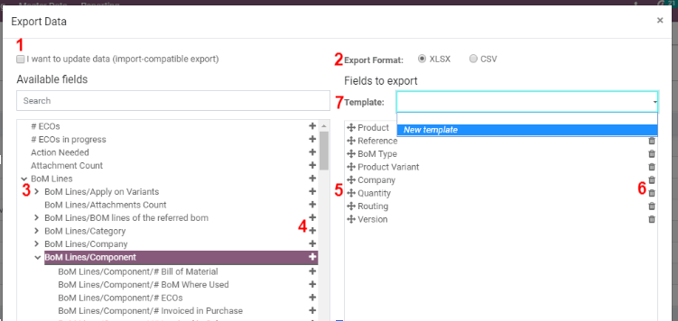

======================
Exporting Data in Odoo
======================

When working with a database, it sometimes appears interesting to have a
backup of the data. That backup ensures you always have access to them
in case of minor or major issues with the database. Also, it can help to
do reporting over your activities (even if Odoo offers a precise and
easy reporting tool with each available application).

With Odoo, you can export nearly any record. The only thing to do is to
activate the list view on the items that need to be exported. Then, hit
the *Action* button and click on *Export*.

.. image:: media/list-view-export.png
   :align: center
   :alt: view of the different things to enable/click to export data

Pretty simple, this action still comes with some specificities. In fact,
when clicking on *Export*, a pop-up window appears with several
options for the data to import:

1. With the *I want to update data* option ticked, the system only
   shows the fields which can be imported. This is very helpful in
   case you want to update existing records. Basically, this works
   like a filter. Leaving the box unticked gives way more field
   options because it shows all the fields, not just the ones which
   can be imported.

2. When exporting, you can choose between two formats: .csv and .xls.
   With .csv, items are separated with a comma, while .xls separated
   items with columns.

3. Those are the items you may want to export. Use the arrows to display
   more sub-field options. Of course, you can use the search bar to
   find specific fields more easily. To use the search option more
   efficiently, display all the fields by clicking on all the
   arrows!

4. The + button is there to add fields to the “to export” list.

5. The “handle” widget allows you to move the fields up and down to
   change the order in which they must be displayed in the exported
   file.

6. The trashcan is there if you need to remove fields (a misclick often
   occurs).

7. For recurring reports, it might be interesting to save a list of
   items. Select all the needed ones and click on the template bar.
   There, click on *New template* and give a name to yours. The
   next time you need to export the same list, simply select the
   related template.

.. tip::
      It’s good to keep the field’s external identifier in mind. For example,
      *Related Company* is equal to *parent_id*. Doing so helps export
      only what you would like to import next.